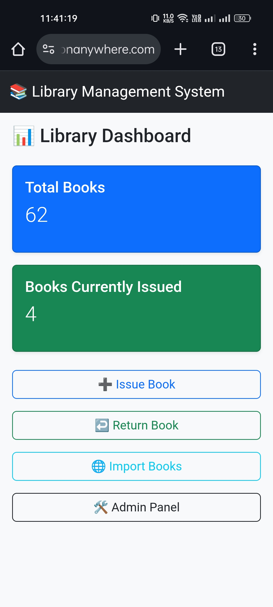
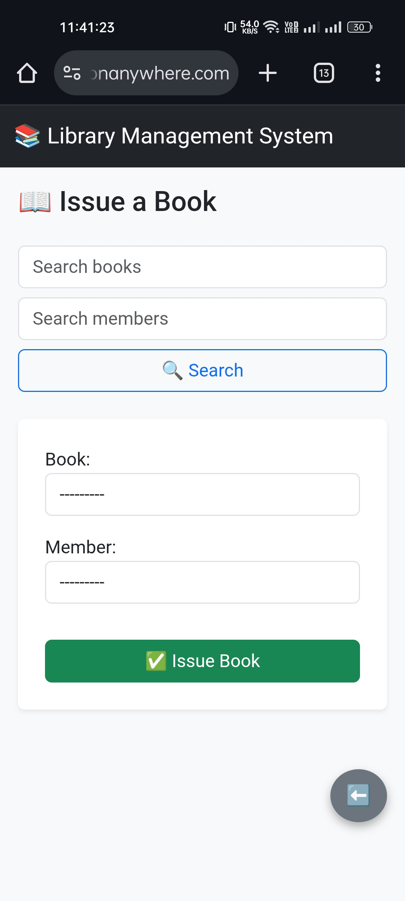
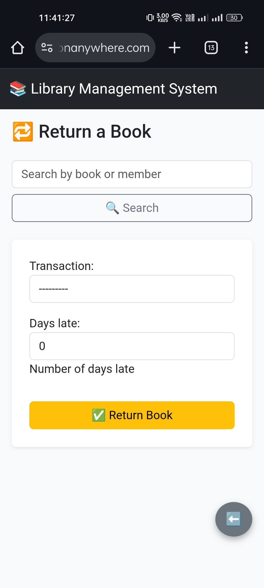
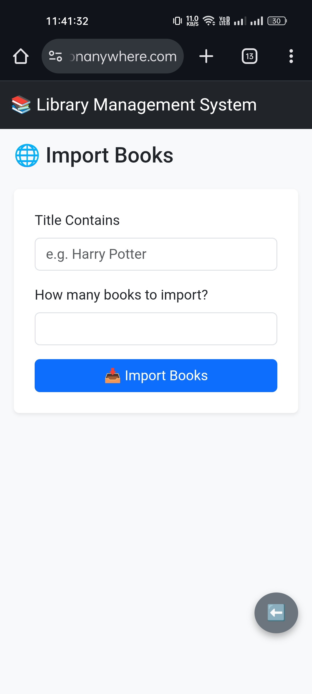
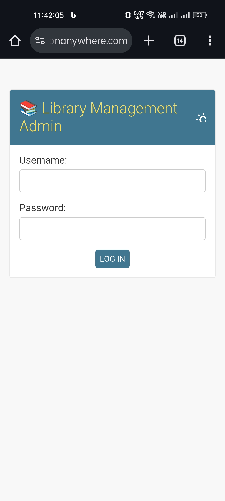

# 📚 Library Management System

A web-based library system built using **Django** for librarians to manage books, members, transactions, and import books from Frappe API.

## 🚀 Features

📦 Book Management: Add/edit/delete books with automatic stock tracking.

🧑 Member Management: Easily manage member records.

🔄 Issue & Return: Issue books with ₹500 debt cap and return them with late fee calculation (₹5/day).

🔍 Smart Search: Live search by book title/author and member name/email.

🌐 Frappe API Integration: Import books page-by-page using live search and custom quantity.

📊 Dashboard: Overview of total books and currently issued ones.

🔐 Admin Panel: Manage everything via Django admin.

📱 Mobile-Responsive UI: Built using Bootstrap 5 with floating buttons and responsive forms.

🔔 Flash Messages: Success/error messages auto-dismiss after 3 seconds for clean UX.

☁️ Live Deployment: Hosted on PythonAnywhere

## 🖥️ Screenshots

| Dashboard | Issue Book | Return Book | Import Page | Admin Panel |
|----------|------------|-------------|-------------|-------------|
|  |  |  |  |  |

## 🔧 Tech Stack

- **Backend:** Django 5.2
- **Frontend:** Bootstrap 5
- **Database:** SQLite3
- **Deployment:** PythonAnywhere
- **API Integration:** Frappe Book API

## 📦 Setup Instructions

```bash
git clone https://github.com/yourusername/library-management-system.git
cd library-management-system
python -m venv env
source env/bin/activate   # or env\Scripts\activate on Windows
pip install -r requirements.txt
python manage.py migrate
python manage.py createsuperuser
python manage.py runserver
```
## 📬 How to Use

### 📥 Import Books
- Go to `/import/`
- Enter a title keyword (e.g. "Harry Potter")
- Enter how many books to import (e.g. 30)
- Books are fetched using the Frappe API and saved to the DB

### 📖 Issue a Book
- Go to `/issue/`
- Search for a book and member
- Submit the form to issue

### 🔁 Return a Book
- Go to `/return/`
- Search and select issued book/member
- Specify days late to auto-calculate fee
- Submit to return and update stock

### 🛠️ Django Admin Panel
- Visit: `/admin/`
- Log in using your superuser account
- Manage books, members, transactions manually

### 📬 Submission Note
- This project was built as part of a Python Developer Hiring Test.
- It showcases full-stack development, API integration, database logic, and deployment.

### 🙋‍♂️ Author
- Vijay Rajage
📧 vijayrajage.py@gmail.com
🌐 [Live App on PythonAnywhere](https://vijayrajage.pythonanywhere.com)

